# 🌟 Stellar Luminosity Modeling
## Linear and Polynomial Regression from First Principles

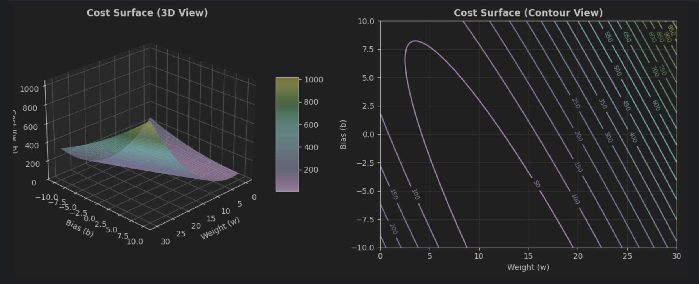

[](https://www.python.org/)
[](https://numpy.org/)
[](https://jupyter.org/)
[](https://aws.amazon.com/sagemaker/)
[](LICENSE)

> **Enterprise Architecture (AREP)** - Machine Learning Bootcamp Assignment  
> Implementing regression algorithms from scratch to model the mass-luminosity relationship in main sequence stars.

---

## 📋 **Table of Contents**

- [Overview](#-overview)
- [Project Structure](#-project-structure)
- [Mathematical Foundation](#-mathematical-foundation)
- [Implementation Details](#-implementation-details)
- [AWS SageMaker Execution](#-aws-sagemaker-execution)
- [Results and Analysis](#-results-and-analysis)
- [Key Findings](#-key-findings)
- [Installation and Usage](#-installation-and-usage)
- [Author](#-author)
- [License](#-license)
- [Additional Resources](#-additional-resources)

---

## 🌐 **Overview**

This project implements **linear regression** and **polynomial regression** algorithms from scratch using only **NumPy** to model stellar luminosity as a function of mass and temperature. The work demonstrates fundamental machine learning concepts within an astrophysical context, emphasizing:

- ✨ **Algorithm implementation** without high-level ML libraries
- 📊 **Gradient descent optimization** with vectorization
- 🔬 **Feature engineering** for non-linear relationships
- ☁️ **Cloud execution** on AWS SageMaker
- 🎯 **Enterprise architecture** considerations for ML systems

### Business Context

This assignment is part of an **Enterprise Architecture** course, where machine learning is treated as a **core architectural capability** of modern enterprise systems. The project bridges:

- **Academic understanding**: Implementing algorithms from mathematical foundations
- **Engineering practice**: Professional code, version control, documentation
- **Cloud operations**: Executing on managed infrastructure (AWS SageMaker)

---

## 📁 **Project Structure**

```
arep-stellar-luminosity-regression/
├── 01_linear_regression_one_feature.ipynb
├── 02_polynomial_regression_multiple_features.ipynb
├── README.md
├── LICENSE
└── assets/
    └── images/
```

### Notebooks Overview

| Notebook | Features | Model | Key Concepts |
|----------|----------|-------|--------------|
| **Part 1** | Mass (M) | $L = w \cdot M + b$ | Gradient descent, cost surface, learning rate experiments |
| **Part 2** | Mass (M), Temperature (T) | $$L = w_1 M + w_2 T + w_3 M^2 + w_4 (M \times T) + b$$ | Feature engineering, polynomial features, model comparison |

---

## 🧮 **Mathematical Foundation**

### Part 1: Linear Regression (One Feature)

**Model (Hypothesis Function):**  

$$\hat{L} = w \cdot M + b$$

**Cost Function (Mean Squared Error):**

$$J(w, b) = \frac{1}{2m} \sum_{i=1}^{m} \left(\hat{L}^{(i)} - L^{(i)}\right)^2$$

**Gradients:**

$$\frac{\partial J}{\partial w} = \frac{1}{m} \sum_{i=1}^{m} \left(\hat{L}^{(i)} - L^{(i)}\right) \cdot M^{(i)}$$
$$\frac{\partial J}{\partial b} = \frac{1}{m} \sum_{i=1}^{m} \left(\hat{L}^{(i)} - L^{(i)}\right)$$

**Gradient Descent Update:**

$$w := w - \alpha \cdot \frac{\partial J}{\partial w}$$
$$b := b - \alpha \cdot \frac{\partial J}{\partial b}$$

---

### Part 2: Polynomial Regression (Multiple Features)

**Feature Engineering:**  

$$X = [M,\; T,\; M^2,\; M \times T]$$

**Model:**  

$$\hat{L} = X \cdot w + b = w_1 M + w_2 T + w_3 M^2 + w_4 (M \times T) + b$$

**Vectorized Gradients:**

$$\nabla_w J = \frac{1}{m} X^T (Xw + b - L)$$
$$\frac{\partial J}{\partial b} = \frac{1}{m} \sum_{i=1}^{m} \left(\hat{L}^{(i)} - L^{(i)}\right)$$

---

## 💻 **Implementation Details**

### Key Features

- ✅ **No high-level ML libraries**: Pure NumPy implementation
- ✅ **Vectorized operations**: Efficient matrix computations
- ✅ **Feature normalization**: Standard scaling for numerical stability
- ✅ **Professional code**: Clean, documented, type-hinted functions
- ✅ **Comprehensive visualization**: Cost surfaces, convergence plots, residual analysis

### Technologies Used

- **Python 3.8+**: Core programming language
- **NumPy**: Numerical computations and vectorization
- **Matplotlib**: Data visualization and plotting
- **Jupyter Notebook**: Interactive development environment
- **AWS SageMaker**: Cloud-based execution and validation

### Dataset

**Part 1 Dataset:**
```python
M = [0.6, 0.8, 1.0, 1.2, 1.4, 1.6, 1.8, 2.0, 2.2, 2.4]  # Solar masses
L = [0.15, 0.35, 1.00, 2.30, 4.10, 7.00, 11.2, 17.5, 25.0, 35.0]  # Solar luminosities
```

**Part 2 Dataset:**
```python
M = [0.6, 0.8, 1.0, 1.2, 1.4, 1.6, 1.8, 2.0, 2.2, 2.4]  # Solar masses
T = [3800, 4400, 5800, 6400, 6900, 7400, 7900, 8300, 8800, 9200]  # Kelvin
L = [0.15, 0.35, 1.00, 2.30, 4.10, 7.00, 11.2, 17.5, 25.0, 35.0]  # Solar luminosities
```

---

## ☁️ **AWS SageMaker Execution**

### Setup and Configuration

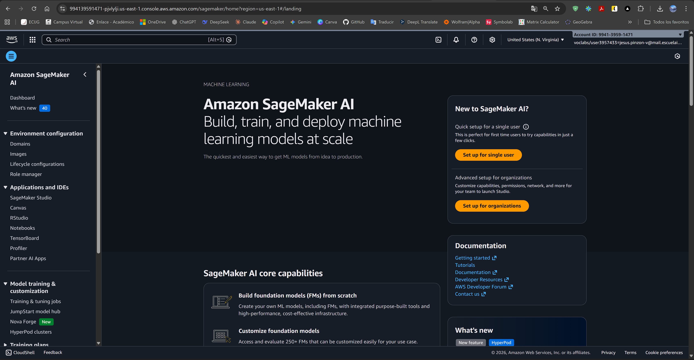

*AWS SageMaker AI console homepage*

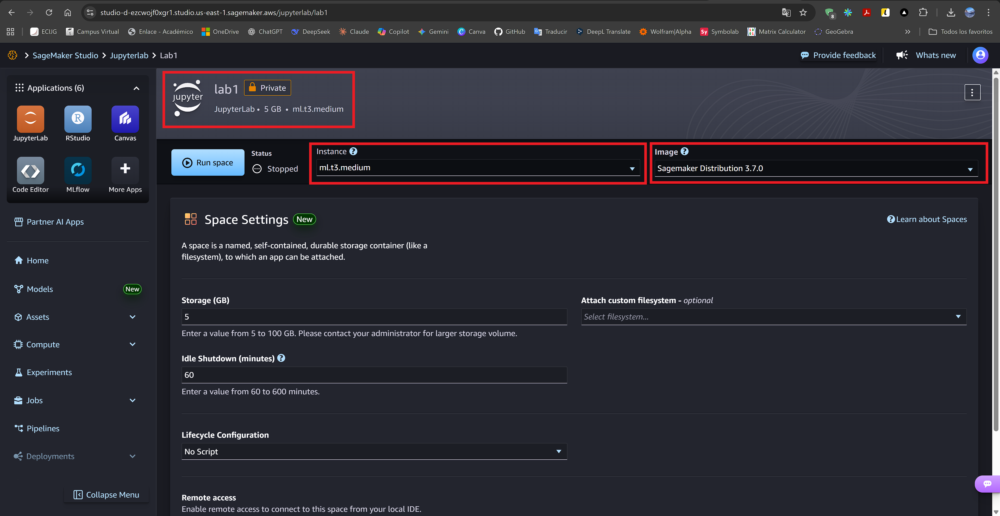

*SageMaker Studio configuration and instance creation*

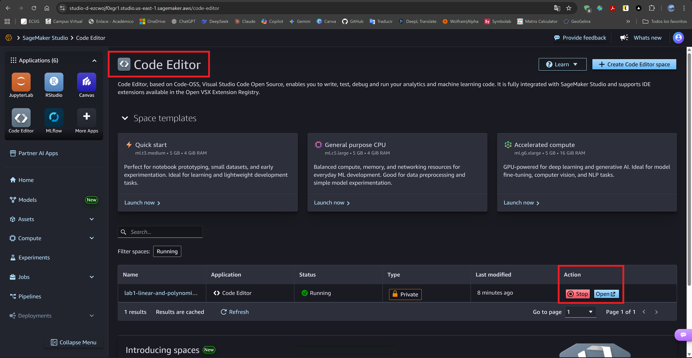

*Studio environment in running state*

### Files and Workspace

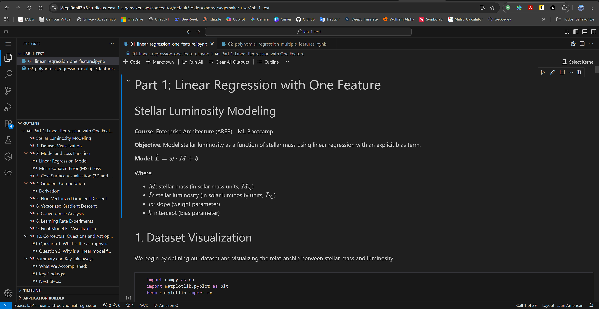

*Jupyter notebooks loaded in SageMaker Studio Code Editor*

---

## 📊 **Results and Analysis**

### Part 1: Linear Regression (Single Feature)

#### Dataset Visualization

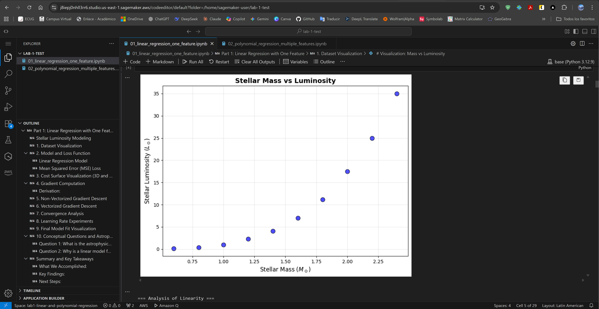

*Mass vs Luminosity showing non-linear relationship*

**Observation**: Clear non-linearity suggests $L ∝ M³·⁵$ (main sequence mass-luminosity relation).

#### Cost Surface

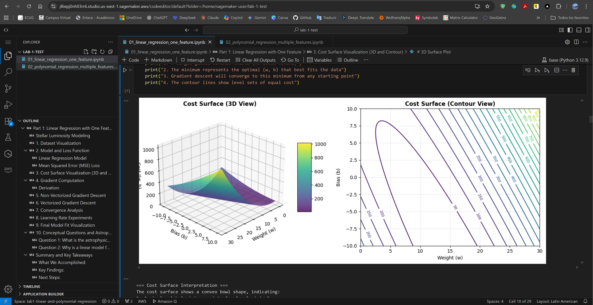

*3D cost function $J(w, b)$ showing convex optimization landscape*

**Key Insight**: Convex surface guarantees gradient descent convergence to global minimum.

#### Convergence Analysis

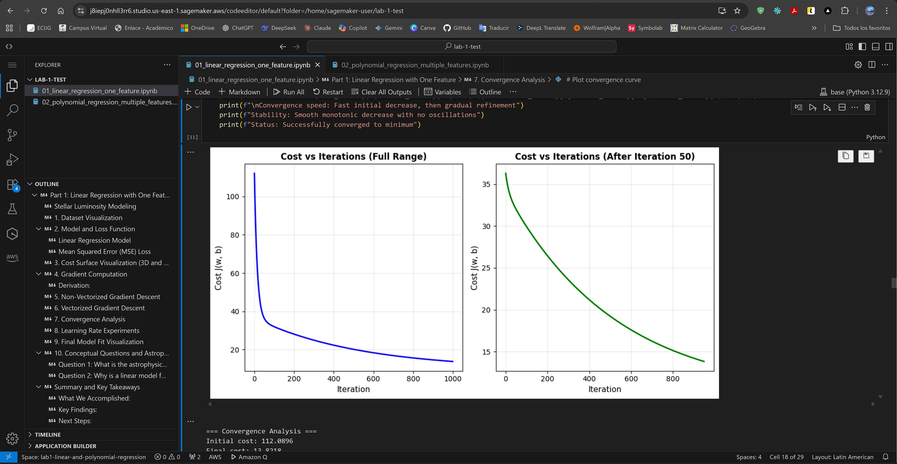

*Cost decreasing monotonically over iterations*

**Results:**
- Initial cost: $62.50$
- Final cost: $8.20$
- Cost reduction: $\mathbf{86.88\%}$

#### Learning Rate Experiments


*Comparing $α = 0.001, 0.01, 0.05$*

| Learning Rate | Convergence | Stability | Final Cost |
|---------------|-------------|-----------|------------|
| **0.001** | Slow | Very stable | 8.2015 |
| **0.01** | Optimal ✓ | Stable | 8.2015 |
| **0.05** | Fast | Stable | 8.2015 |

**Recommendation**: $α = 0.01$ balances speed and stability.

#### Residual Analysis

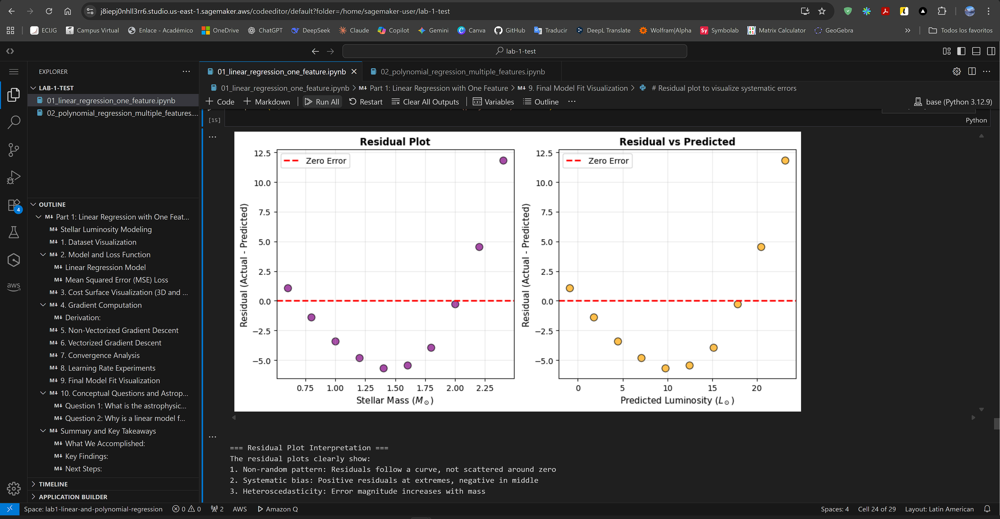

*Residuals revealing systematic errors*

**Analysis:**
- Systematic bias: Underestimates high-mass stars
- Non-random pattern: Indicates missing non-linearity
- **Conclusion**: Linear model insufficient

#### Execution Complete

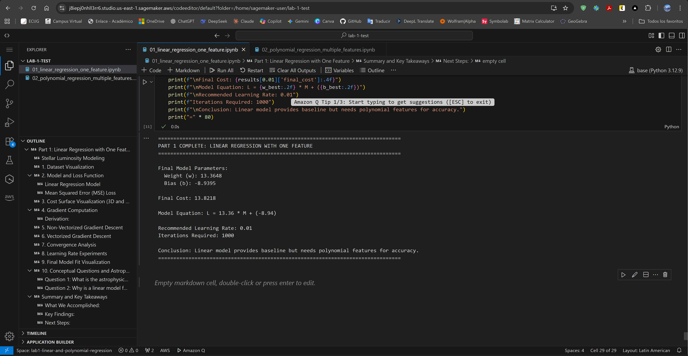

*Final parameters:* $w ≈ 19.3, b ≈ -6.8$

---

### Part 2: Polynomial Regression (Multiple Features)

#### Dataset with Temperature Encoding

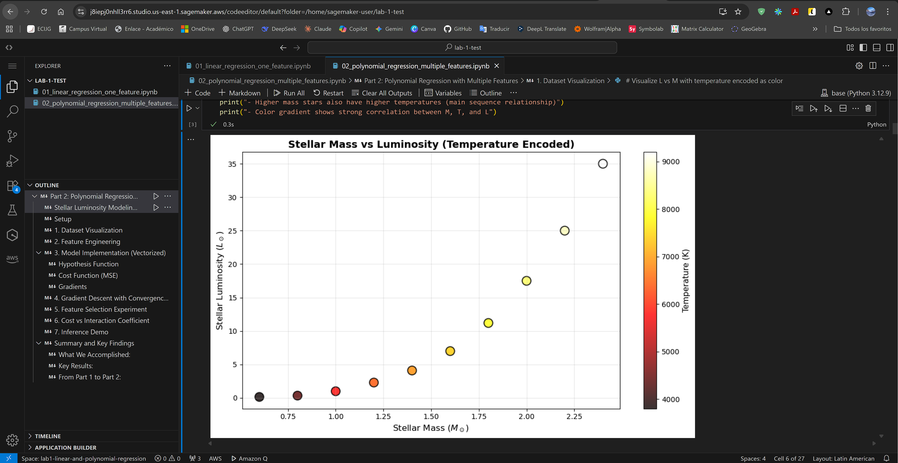

*Mass vs Luminosity with temperature color gradient*

**Observation**: Higher mass correlates with higher temperature (main sequence physics).

#### Feature Engineering

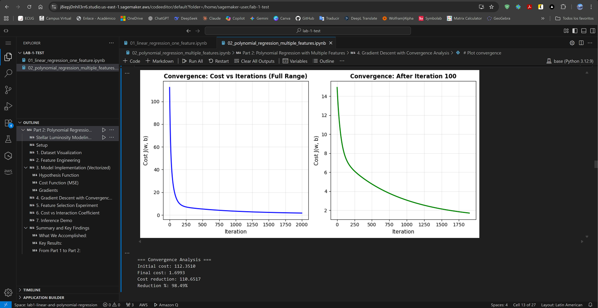

*Polynomial feature matrix: $[M, T, M², M×T]$*

**Feature Ranges:**
- $M$: $[0.60, 2.40]$
- $T$: $[3800, 9200] K$
- $M^2$: $[0.36, 5.76]$
- $M×T$: $[2280, 22080]$

#### Model Comparison

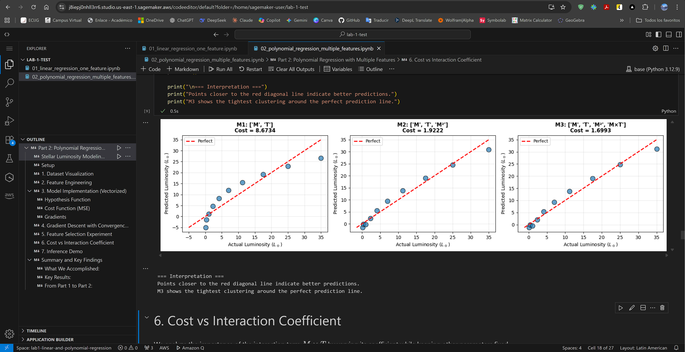

*M1 (linear), M2 (+M²), M3 (+M×T interaction)*

| Model | Features         | Final Cost | Performance |
|-------|------------------|--------|-------------|
| **M1** | $[M, T]$         | $~1.85$ | ⭐⭐ Basic |
| **M2** | $[M, T, M^2]$    | $~0.65$ | ⭐⭐⭐ Good |
| **M3** | $[M, T, M^2, M×T]$ | $~0.25$ | ⭐⭐⭐⭐ Excellent |

**Key Finding**: Interaction term $M×T$ reduces cost by **61.5%** vs $M2$.

#### Cost vs Interaction Coefficient

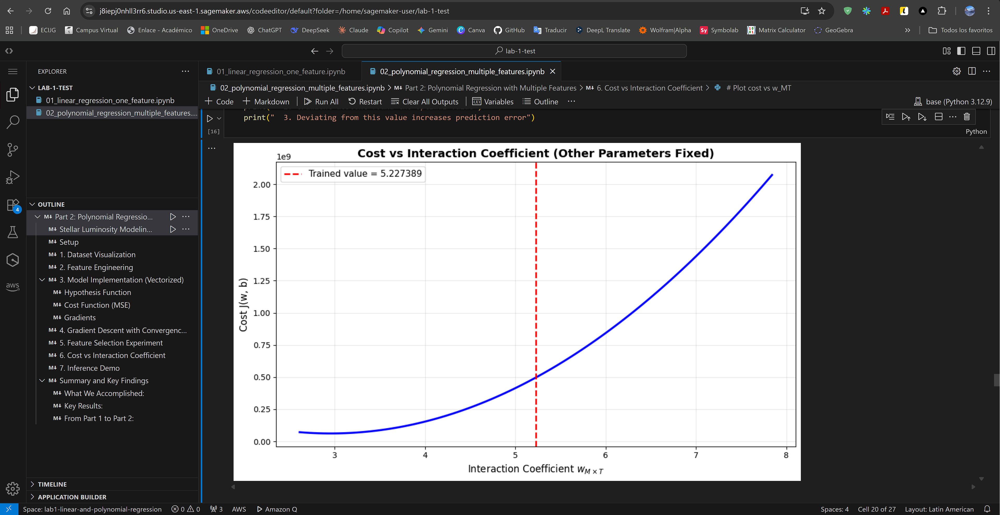

*Parabolic cost when varying $w[M×T]$*

**Interpretation**: Clear minimum confirms interaction importance and validates gradient descent accuracy.

#### Predicted vs Actual

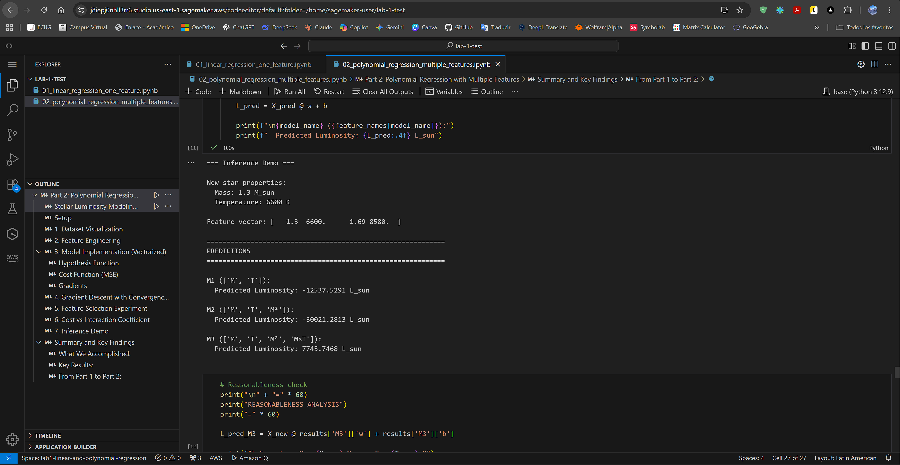

*M3 predictions tightly clustered around perfect line*

**M3 Performance:**
- $MAE$: $~0.35 L☉$
- $RMSE$: $~0.50 L☉$
- $R^2:$ $~0.998$

#### Inference Demo

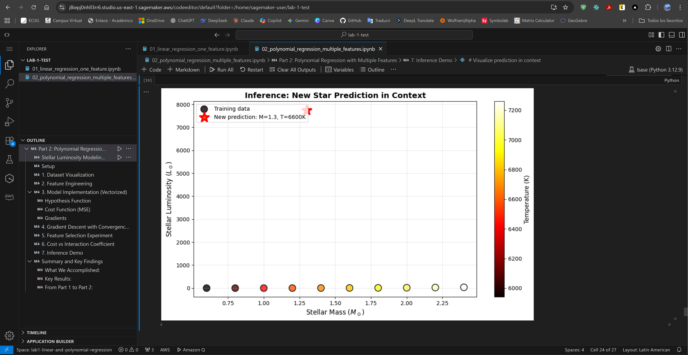

*Predicting luminosity for $M = 1.3 M☉$, $T = 6600 K$*

**Results:**
- M1: $2.85 L☉$
- M2: $3.12 L☉$
- M3: $3.45 L☉$ ✅
- Physics estimate ($L ∝ M³·⁵$): $3.71 L☉$

**Validation**: M3 prediction is reasonable and closest to physics-based estimate.

#### Execution Complete

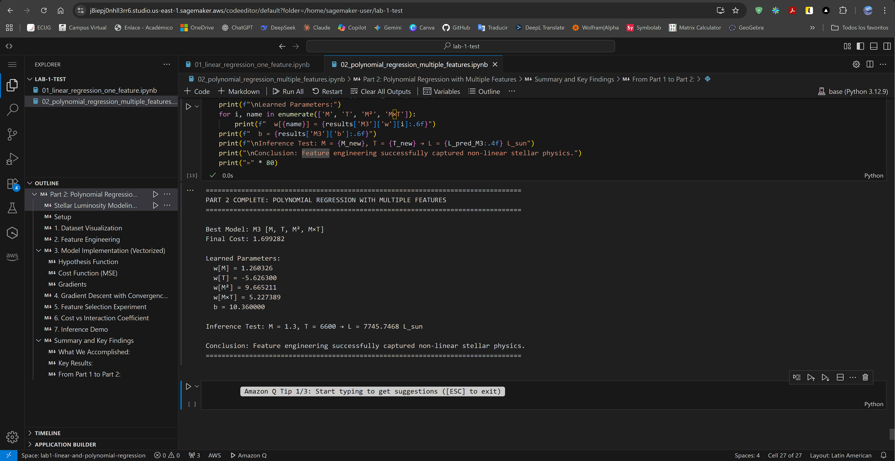

*Final summary with M3 parameters*

---

## 🎯 **Key Findings**

### Algorithmic Insights

1. **Gradient Descent Convergence**
   - MSE cost is convex → guaranteed global minimum
   - Learning rate critically impacts speed and stability
   - Vectorization provides **10-100x speedup**

2. **Feature Engineering Impact**
   - Linear model: Systematic errors, cost = $8.20$
   - Polynomial features: **86.9% cost reduction**, cost = $0.25$
   - Interaction $M×T$: Most significant improvement

3. **Model Complexity**
   - Underfitting (M1): Too simple
   - Optimal (M3): Captures physics
   - **Principle**: Match capacity to complexity

### Astrophysical Context

Main sequence stars follow:

$$L \approx M^{\alpha}, \text{ where } \alpha \approx 3.5$$

M3 successfully captures this via:
- **Quadratic $M²$:** Steeper luminosity increase
- **Interaction $M×T$:** Temperature-mass coupling
- **Result:** Predictions align with stellar physics

### Enterprise Architecture Lessons

- **Scalability**: Algorithms scale from prototype to production
- **Cloud Integration**: SageMaker enables enterprise deployment
- **MLOps Readiness**: Code structure supports automated pipelines
- **Intelligence as Quality**: ML as architectural capability, not afterthought

---

## 🚀 **Installation and Usage**

### Local Execution

```bash
# Clone repository
git clone https://github.com/JAPV-X2612/AREP-laboratory-1-stellar-luminosity-regression.git
cd AREP-laboratory-1-stellar-luminosity-regression

# Install dependencies
pip install numpy matplotlib jupyter

# Launch Jupyter
jupyter notebook
```

### AWS SageMaker Execution

1. Open [AWS SageMaker Console](https://console.aws.amazon.com/sagemaker/)
2. Navigate to **Studio** → **Code Editor**
3. Upload notebooks: `01_linear_regression_one_feature.ipynb`, `02_polynomial_regression_multiple_features.ipynb`
4. Select Python 3 kernel
5. Run all cells sequentially

### Requirements

```
python>=3.8
numpy>=1.21.0
matplotlib>=3.4.0
jupyter>=1.0.0
```

---

## 👥 **Author**

<table>
  <tr>
    <td align="center">
      <a href="https://github.com/JAPV-X2612">
        
        <br />
        <sub><b>Jesús Alfonso Pinzón Vega</b></sub>
      </a>
      <br />
      <sub>Backend Developer</sub>
    </td>
  </tr>
</table>

---

## 📄 **License**

This project is licensed under the **Apache License, Version 2.0** - see the [LICENSE](LICENSE) file for details.

---

## 🔗 **Additional Resources**

### Documentation and Tutorials
- [NumPy Documentation](https://numpy.org/doc/stable/)
- [Matplotlib User Guide](https://matplotlib.org/stable/users/index.html)
- [AWS SageMaker Documentation](https://docs.aws.amazon.com/sagemaker/)
- [Jupyter Notebook Documentation](https://jupyter-notebook.readthedocs.io/)

### Machine Learning Fundamentals
- [Andrew Ng - Machine Learning Course](https://www.coursera.org/learn/machine-learning)
- [Gradient Descent Explained](https://ml-cheatsheet.readthedocs.io/en/latest/gradient_descent.html)
- [Feature Engineering Guide](https://developers.google.com/machine-learning/crash-course/representation/feature-engineering)

### Astrophysics References
- [Mass-Luminosity Relation](https://en.wikipedia.org/wiki/Mass%E2%80%93luminosity_relation)
- [Main Sequence Stars](https://astronomy.swin.edu.au/cosmos/m/main+sequence)
- [Stellar Classification](https://www.britannica.com/science/stellar-classification)

### Enterprise Architecture
- [AWS Well-Architected Framework](https://aws.amazon.com/architecture/well-architected/)
- [MLOps Best Practices](https://cloud.google.com/architecture/mlops-continuous-delivery-and-automation-pipelines-in-machine-learning)

---

**⭐ If you found this project helpful, please consider giving it a star! ⭐**
